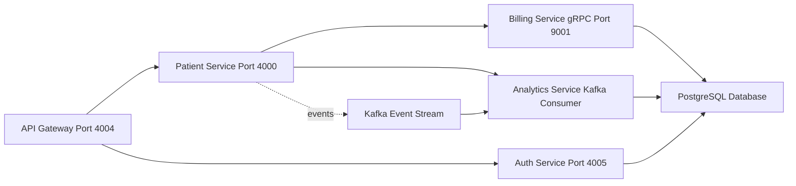

# Patient-Management
A comprehensive, cloud-native patient management system built with Spring Boot microservices, featuring modern architectural patterns and enterprise-grade technologies.

## 🏗️ System Architecture Overview

This project implements a microservices-based architecture designed for scalability, security, and cloud-native deployment.

### 🚀 Core Microservices

🔑 Auth Service – JWT-based authentication & authorization

👥 Patient Service – Core patient data management with CRUD operations

💰 Billing Service – Patient billing account management via gRPC

📊 Analytics Service – Event-driven analytics & reporting

🌐 API Gateway – Centralized routing, load balancing & JWT validation

### 🛠️ Technology Stack
#### 🔹 Backend

🔸 Java 24 with Spring Boot 3.5.3

🔸 Spring Security with JWT authentication

🔸 Spring Data JPA with PostgreSQL

🔸 gRPC for inter-service communication

🔸 Apache Kafka for event streaming

🔸 Spring Cloud Gateway for API routing

#### 🔹 Infrastructure & DevOps

🔸 AWS CDK for Infrastructure as Code

🔸 Docker containerization

🔸 AWS ECS Fargate for container orchestration

🔸 AWS RDS (PostgreSQL) for managed databases

🔸 AWS MSK (Kafka) for event streaming

🔸 LocalStack for local development

#### 🔹 Development & Documentation

🔸 OpenAPI/Swagger for API documentation

🔸 Maven for dependency management

🔸 Comprehensive integration tests

### ✨ Key Features

🔒 Secure Authentication – Robust JWT-based auth with token validation

👥 Patient Management – Complete CRUD operations for patient records

💳 Billing Integration – Automated billing account creation

📈 Real-Time Analytics – Kafka-powered event-driven insights

🔄 Event-Driven Architecture – Asynchronous inter-service communication

📚 API Documentation – Auto-generated Swagger/OpenAPI docs

🐳 Containerized Deployment – Multi-stage Docker builds

☁️ Cloud-Native – AWS infrastructure powered by CDK

### 🏛️ System Architecture  

### 🎯 Use Cases

🏥 Healthcare Providers – Manage patient records & billing

🏨 Medical Facilities – Streamline patient registration & data management

📊 Healthcare Analytics – Track patient events & generate insights

🌍 Multi-Tenant Systems – Scalable architecture for multiple healthcare organizations

### 🔧 Development Features

✅ Validation Groups – Custom validation for different operations

✅ Exception Handling – Global error handling with proper HTTP status codes

✅ Event Publishing – Kafka-based event publishing for patient operations

✅ Database Migrations – JPA-based schema management

✅ Health Checks – Database & service health monitoring

### 📖 Project Highlights

✅ Scalable microservices design

✅ Event-driven communication with Kafka

✅ Secure authentication & authorization layer

✅ Cloud-native infrastructure with AWS ECS, RDS & MSK
✅ Developer-friendly with LocalStack & Swagger/OpenAPI

